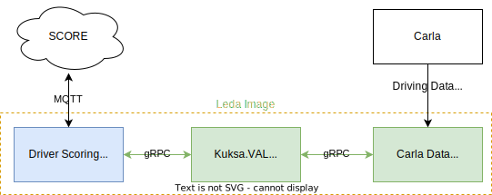
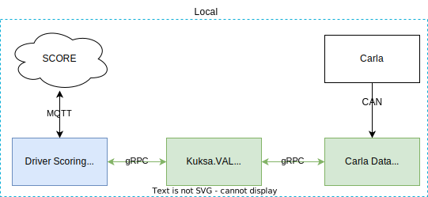

# Score your driving!

---

# Introduction

Show off your driving skills!

Our app evaluates your driving ability.

Smooth acceleration, braking, maintaining your lane, and other various factors affect your driving score.

This project is created with eclipse SDV's open-source, incorporating a clean Vehicle Abstraction Layer and even features OTA (Over-The-Air) capabilities.

# Demo

-video- 

# Architecture

### in Leda

### in Local

- When driving in Carla, necessary information is sent in a CSV format locally and through a virtual CAN to the CAN Feeder in leda, conforming to the VSS standard.
- The CSV Provider and CAN Feeder send data received from Carla to the data broker, renaming and reformatting it according to the VSS standard.
- Applications subscribe to the data broker, continuously receiving necessary data, which is then inputted into a trained LSTM model to evaluate the driving score.

For more details, please refer to the README in each folder!
