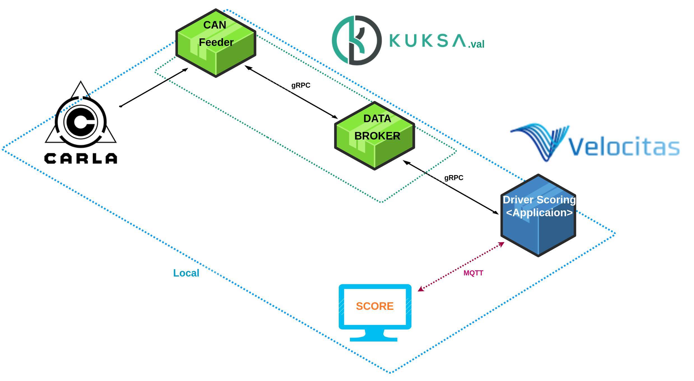
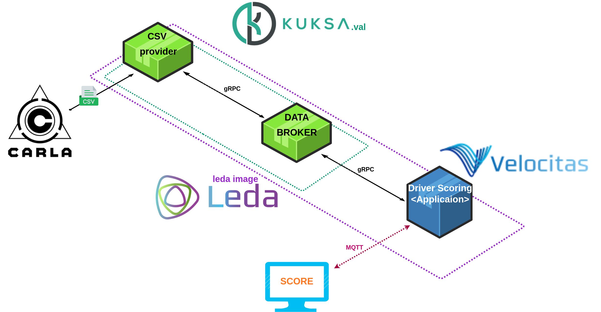

# Driving Aassistance
# **Hackathon Challenges**

## Detailed Description of the Hackathon Challenges

- **Seat Adjust Challenge**
    
    In this hack challenge, you develop your Vehicle Application using [Eclipse Velocitas](https://eclipse.dev/velocitas/). You start by setting up a **Seat Adjuster** example and then extend it with *individual ideas*. For instance, you may allow the delivery of packages to your trunk, or create individualized welcome sequences when the driver approaches the vehicle.
    
    The Seat Adjuster showcases how to create a Vehicle Application that senses and actuates signals in a vehicle through Eclipse Kuksa and the Vehicle Signal Specification (VSS). It runs on Eclipse Leda, and we use Eclipse Velocitas for the development.
    
- **Carla**

     Used the carla simulator to obtain CAN data about driving. We used the carla simulator's two methods of autonomous driving and manual driving to distinguish between data showing proper driving and data showing incorrect driving.

# Project Introduction
Show off your driving skills! Our app evaluates your driving ability. 

- The project scores drivers by taking into account different aspects of driving a vehicle. This includes speed regulation, steering control, braking ability, lane keeping, etc. Each driver's behavior is analyzed by a deep learning algorithm, providing highly objective and accurate scores.
 This approach promotes safe driving habits among drivers and contributes to reducing risky driving behavior, creating a safe driving culture.
- It is built on the open source framework of Eclipse SDV and integrates a vehicle abstraction layer to make it compatible with a wide range of vehicles. Additionally, over-the-air (OTA) functionality ensures smooth software updates and data transfers.

# Technical Background
### **Overview of Develop your Eclipse Velocitas vehicle application Blueprints**

# Demo

 Currently, this demo is running in real time in a LOCAL environment. On the right is the CAN DATA output and transmitted from carla, and on the bottom is the vehicle driving score calculated in the application using data received from the can feeder and databroker.

# Structure
- We generated data through CARLA and created a driving evaluation model using a deep learning model. Please check README.md in [dl-with-carla](./dl-with-carla) for details.
- When driving in Carla, necessary information is sent in a CSV format locally and through a virtual CAN to the CAN Feeder in leda, conforming to the VSS standard.
- The CSV Provider and CAN Feeder send data received from Carla to the data broker, renaming and reformatting it according to the VSS standard.
- Applications subscribe to the data broker, continuously receiving necessary data, which is then inputted into a trained LSTM model to evaluate the driving score.

## 1. Local Environment

- In the CARLA simulator, CAN data is collected, such as various data speeds, throttle, steering, braking, and lane keeping of the vehicle being driven. This data is sent to the kuksa.val data broker via CAN Feeder, which then forwards this CAN data to the Velocitas application via the gRPC protocol.
    
     The Velocitas application takes this data and uses a deep learning model to calculate a driving score, which is then provided to the driver in real time. The system provides drivers with immediate feedback on their driving habits, giving them the opportunity to improve their driving behavior.
    

## 2. Leda Environment

- After driving in the CARLA simulator, various data of the vehicle such as speed, throttle, steering, brake, and lane keeping status are saved as a csv file during the driving process. This data is transferred from the Leda environment to the kuksa.val data broker via the CSV provider, and this data is then delivered to the Velocitas application via the gRPC protocol.
    
     The Velocitas application takes this data and uses a deep learning model to calculate a driving score for that drive, which is then provided to the driver after completing the drive. The system provides drivers with an evaluation of their current driving, giving them the opportunity to improve their next driving.

# Expected Outcomes of the Our Project

## 1. Insurance

By developing customized insurance products based on individual driving habits, we can increase customer satisfaction and provide insurance companies with a competitive advantage.

1. **Establishment of clear standards through the introduction of deep learning-based models**: By utilizing deep learning-based models, a driver’s driving score can be evaluated more accurately. This system provides an opportunity to better assess the riskiness of individual drivers and make insurance premiums fairer.
2. **Provides a competitive advantage**: Insurance companies that adopt this technology will be able to promote products that set fair premiums for policyholders. As a result, it provides a competitive advantage in the insurance market.
3. **Cost savings for insurance companies**: It can have the effect of reducing accident rates by encouraging safe driving, which can lead to cost savings for insurance companies.

## 2. Taxi Platform (Uber, Freenow, Bolt, etc)

It can improve the service quality of taxi platforms and have a positive impact on both customers and drivers.

1. **Improved customer trust**: When driver scores are transparently disclosed, customers have confidence in the safety and reliability of the driver, increasing trust in the service.
2. **Improve driver behavior**: Drivers will be motivated to maintain good scores, encouraging safe driving and reducing accident rates.
3. **Reduced insurance premiums**: Safe driving behavior can lead to reduced accident rates, which can lead to cost benefits such as reduced insurance premiums.
4. **Enhanced competitiveness**: A system that guarantees driver quality can increase customer preference for taxi platforms and provide differentiated competitiveness compared to competitors.
5. **Increased brand value of the platform**: Providing safe and reliable services can contribute to increasing the brand value of the taxi platform.

## 3. Detection of suspected abnormal drivers (drowsy or drunk)

 It can be of great help to governments and police to effectively manage road safety and prevent accidents. Additionally, it can be an important means of improving public safety and reducing social costs.

1. **Enhanced Safety**: Significantly improves road safety by effectively detecting and preventing drunk or drowsy driving.
2. **Increased Law Enforcement Efficiency**: Police and other agencies can more easily detect and act on risky driver behavior, increasing the effectiveness of law enforcement.
3. **Reduced accident rates**: By contributing to reducing accidents caused by drunk and drowsy driving, it can reduce social costs and reduce the number of insurance claims.
4. **Increasing trust in public safety**: As governments and police utilize these systems to enhance public safety, citizen trust and satisfaction can increase.
5. **Supports data-driven policy making**: Data collected from these systems can better inform policy decisions related to traffic safety and contribute to the creation of effective measures.

# Team Introduction

Team Leader: Donghwan Seo

Team members: Jaehyeong Park, Daekyung La, Seungwoo Lee, Jaeha Lee 
