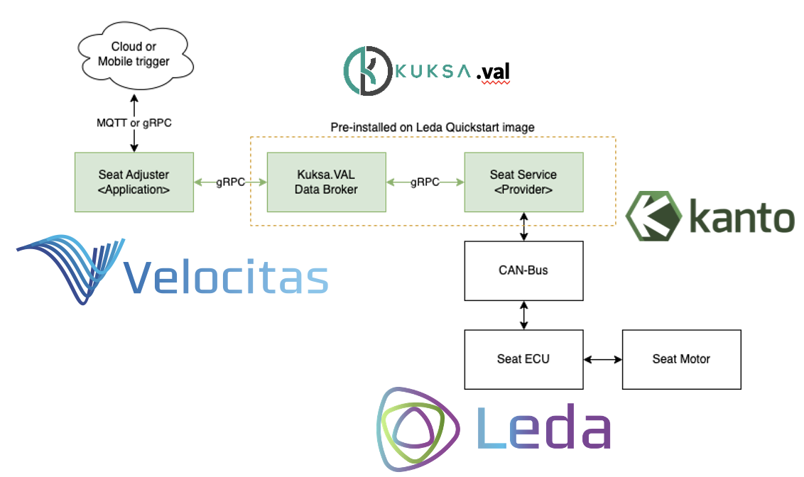
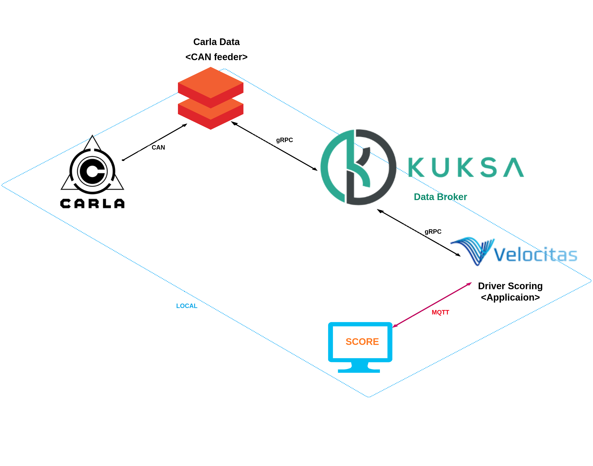
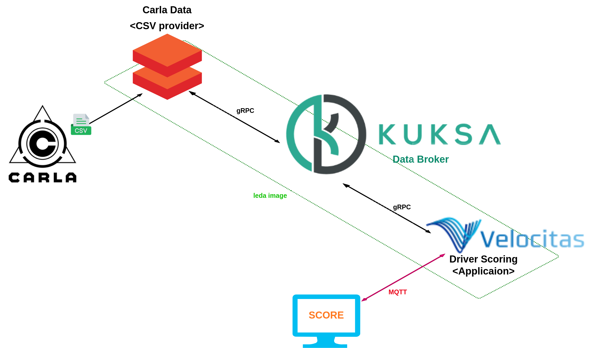

# Score your driving

---

# Team Introduction

Team Leader: Donghwan Seo

Team members: Jaehyeong Park, Daekyung La, Seungwoo Lee, Jaeha Lee 

# **Hackathon Challenges**

## Detailed Description of the Hackathon Challenges

- **Seat Adjust Challenge**
    
    In this hack challenge, you develop your Vehicle Application using [Eclipse Velocitas](https://eclipse.dev/velocitas/). You start by setting up a **Seat Adjuster** example and then extend it with *individual ideas*. For instance, you may allow the delivery of packages to your trunk, or create individualized welcome sequences when the driver approaches the vehicle.
    
    The Seat Adjuster showcases how to create a Vehicle Application that senses and actuates signals in a vehicle through Eclipse Kuksa and the Vehicle Signal Specification (VSS). It runs on Eclipse Leda, and we use Eclipse Velocitas for the development.
    
- **Carla**

     Used the carla simulator to obtain CAN data about driving. We used the carla simulator's two methods of autonomous driving and manual driving to distinguish between data showing proper driving and data showing incorrect driving.

# Project Introduction
Show off your driving skills! Our app evaluates your driving ability. 

- The project scores drivers by taking into account different aspects of driving a vehicle. This includes speed regulation, steering control, braking ability, lane keeping, etc. Each driver's behavior is analyzed by a deep learning algorithm, providing highly objective and accurate scores.
 This approach promotes safe driving habits among drivers and contributes to reducing risky driving behavior, creating a safe driving culture.
- It is built on the open source framework of Eclipse SDV and integrates a vehicle abstraction layer to make it compatible with a wide range of vehicles. Additionally, over-the-air (OTA) functionality ensures smooth software updates and data transfers.

# Technical Background

### **Overview of Develop your Eclipse Velocitas vehicle application Blueprints**

# Demo

-video

# Structure

- When driving in Carla, necessary information is sent in a CSV format locally and through a virtual CAN to the CAN Feeder in leda, conforming to the VSS standard.
- The CSV Provider and CAN Feeder send data received from Carla to the data broker, renaming and reformatting it according to the VSS standard.
- Applications subscribe to the data broker, continuously receiving necessary data, which is then inputted into a trained LSTM model to evaluate the driving score.

## 1. Local Environment

- In the CARLA simulator, CAN data is collected, such as various data speeds, throttle, steering, braking, and lane keeping of the vehicle being driven. This data is sent to the kuksa.val data broker via CAN Feeder, which then forwards this CAN data to the Velocitas application via the gRPC protocol.
    
     The Velocitas application takes this data and uses a deep learning model to calculate a driving score, which is then provided to the driver in real time. The system provides drivers with immediate feedback on their driving habits, giving them the opportunity to improve their driving behavior.
    

## 2. Leda Environment

- After driving in the CARLA simulator, various data of the vehicle such as speed, throttle, steering, brake, and lane keeping status are saved as a csv file during the driving process. This data is transferred from the Leda environment to the kuksa.val data broker via the CSV provider, and this data is then delivered to the Velocitas application via the gRPC protocol.
    
     The Velocitas application takes this data and uses a deep learning model to calculate a driving score for that drive, which is then provided to the driver after completing the drive. The system provides drivers with an evaluation of their current driving, giving them the opportunity to improve their next driving.
     
